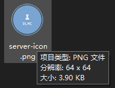

# 美化你的Minecraft服务器

## 介绍

害，搞了那么多乱七八糟的东西，有没有发现你的服务器在游戏客户端的服务器列表里还是平平无奇的

`A Minecraft Server`和一个灰不拉几的图标？

本文内就将教会你如何美化你的服务器在服务器列表的形象！

## 图标

先从简单的开始。

看见那个灰不拉几甚至看久了有点丑的默认图标了不？

我们就先把他干掉！

步骤也简单到起飞，你只需要找到一个.png格式的图标（你不知道啥是png格式？那请[Bing一下](https://www.bing.com/)），然后利用各种乱七八糟你能想得到的方式将他的尺寸改为**64像素 × 64像素**，然后将文件名重命名为`server-icon.png`，就像这样：



然后把这个文件上传/复制/剪切至你的服务端里，跟你的服务端核心放在同一个文件夹里，然后重启服务端，你就能看到你的新图标辣！

### 还是看不到图标？还是有很多问题？欢迎[加群交♂流](https://jq.qq.com/?_wv=1027&k=5v31lJZY)！

## MOTD

这个嘛。。我们就需要借助插件辣！

我推荐的MOTD插件有：[CleanMOTD](https://www.spigotmc.org/resources/2ls-cleanmotd-the-ligthest-motd-plugin.58268/) [MOTD](https://www.spigotmc.org/resources/motd-1-8-1-19-2.8390/)

本文将拿插件 **CleanMOTD** 下手

```   
                    我是分割线   
```

### 施工ing