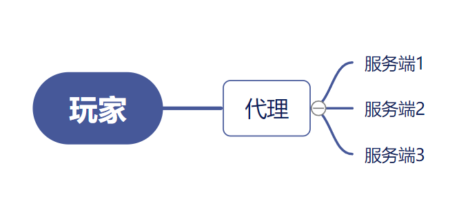

# 群组服务端

欢迎回来！
> 是不是做腻了单个的服务端？是不是嫌单端能干的事太少？是不是嫌单端性能太差？今天来教你些好玩哒！

## 原理

啊我们既然要让多个服务端进行通信等等，我们就要先了解它的原理，工作流程等等。

简单来说群组就是新增了一个被称为代理的服务端来进行多个服务端的协调工作，我画了个图来大概介绍他的工作流程

就是说玩家所有的操作，包括服务器进出等等都是要经过代理的，但是代理又不完全是一个服务端，它可以管理一些数据比如封禁玩家抑或是将玩家从`服务端1`传送到`服务端2`等等，

但是代理他不是一个实际性的游戏服务端，代理里不包含任何游戏地图等等，就是说它很轻量，通常只需要512MB的内存就能承载几十人。

## 代理核心挑选

啊那现在我们了解了原理，那我们该选择哪个软件或者说是核心来进行代理工作呢？

跟Minecraft服务端差不多，代理有两大阵营并且支持的插件各不同，而且都很好用，可以根据需求进行挑选：

### BungeeCord

BungeeCord由md_5为主的开发者团队进行开发（是的跟Spigot是同一波人），对Spigot及其fork有较好的兼容性，BungeeCord需要自行编译才能使用；

推荐使用BungeeCord的fork: [WaterFall](https://papermc.io/downloads#Waterfall)

### Velocity

Velocity算是比较出名的新起之秀了，由WaterFall即Paper服务端开发者团队PaperMC开发，意在提供更好的性能更稳定的代理软件，

但是就像Spigot与Sponge一样，Velocity与BungeeCord的插件并不相通，并且Velocity的插件与BungeeCord相比之下会少很多。

[下载](https://papermc.io/downloads#Velocity)