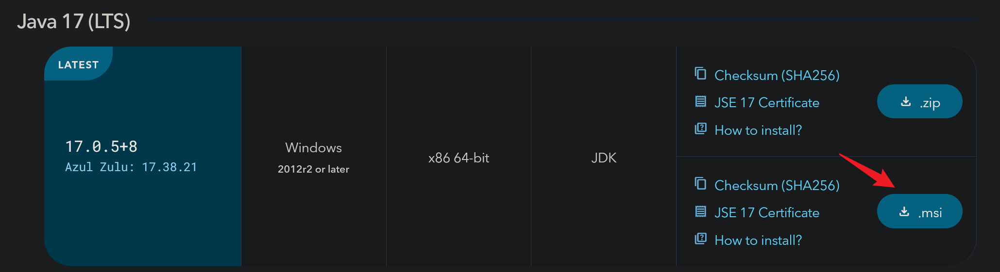

# 安装Java

?> 啊想必各位帅比都选好了系统。那么本文中就将教你如何安装Minecraft: Java Edition服务段中最重要的运行环境：Java

## 我需要什么版本的Java？

欸你别说，~~这选Java还真是一门学问~~，我们如果要开Minecraft服务器，不仅要选对Java的发行商，还要选对我们要用的版本。

而Java的发行商，本文在此墙裂推荐[Azul Zulu OpenJDK](https://www.azul.com/downloads/?package=jdk#download-openjdk)

优化好名气高而且安装还简单！

至于Java的版本，取决于你的服务端游戏版本，

可以参考下表：

|  Java版本   | 游戏版本   | 可用性  |
|  ----  | ----  | ---  |
| 8(1.8) LTS  | 1.8.8 + | 1.16.5及以下版本 |
| 11 LTS  | 1.8.8+ | 1.16.5及以下版本  |
| 17 LTS  | 1.8.8+ | 最新版本及以下  |

# 系统

> [Windows](#windows)\
> [Linux](#linux)

# Windows

啊我们先来看看Zulu的OpenJDK怎么在Windows(Server)上安装

## 下载

打开这个网站 [传送门](https://www.azul.com/downloads/?os=windows&package=jdk#download-openjdk)

然后你会看到很多版本的Java并且后面的括号里都标注了`STS`或者`LTS`，你可以直接**忽略**那些`STS`版本，

然后往下翻或者通过上方筛选器快速查找你需要的LTS版本，再在选项卡右侧点击名为 `.msi` 的按钮。随后你的浏览器就会开始下载安装包。

下载完成后直接双击打开，随后你要做的事只有不停点击右下角的`Next`或者`Install`亦或是`Finish`直至窗口关闭，然后你的Java就安装完成辣！

# Linux

Linux稍微麻烦一点，安装方法大致不变但是需要参考官方文档，只需要按照文档说明一条一条执行指令即可

[Debian/Ubuntu/Deepin/UOS](https://docs.azul.com/core/zulu-openjdk/install/debian)

[CentOS/Rocky Linux/Alma Linux/Fedora](https://docs.azul.com/core/zulu-openjdk/install/rpm-based-linux)