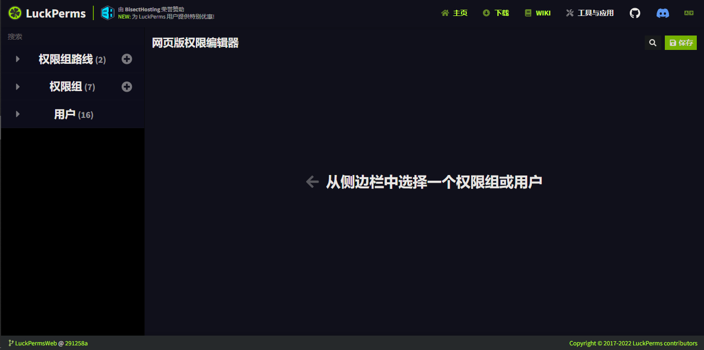
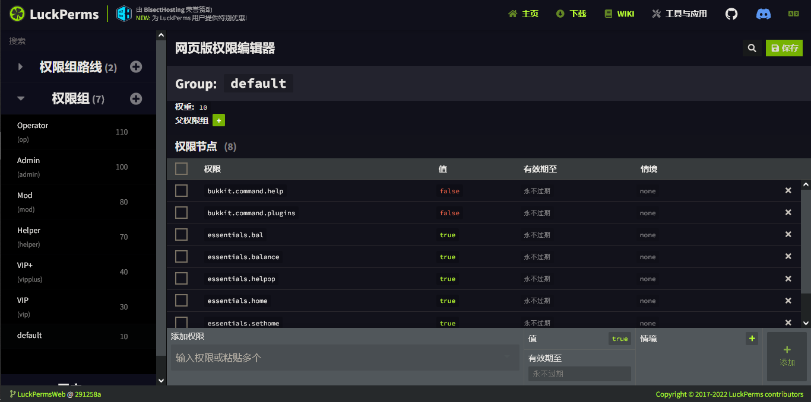

# LuckPerms

## LuckPerms是啥？

LuckPerms 是为 Minecraft 设计的服务器权限插件。它允许服务器管理员通过创建组和分配权限来控制玩家可以使用的功能。 

### 为什么选择LuckPerms？

- 响应迅速 - 在开发之初便已经将性能和可扩展性放在首位。
- 深受信赖 - 被数以千计的服务器管理者使用，再大型的服务器也有我们的身影。
- 简易上手 - 通过命令，配置文件，网页版编辑器等方式添加您的权限。
- 高效灵活 - 支持多种不同的存储方式与服务器平台。
- 可客制化 - 为您的服务器提供大量的自定义选项和设置，以便您最大程度客制化使用体验。
- 永远免费 - 由于许可证的选用，它可以做到永远免费地提供下载和使用。

## 如何安装？

前往 [LuckPerms官网](https://luckperms.net) 下载你的服务端对应版本然后进行安装即可。

## 如何使用？

LuckPerms的基本使用可以说是只要有点脑子都能轻松使用，

安装后只需要进入对应插件文件夹下的 `config.yml` 进行数据库配置（甚至某些情况下都不需要配置），然后在游戏里/控制台里输入指令：

```
/lp editor
```

然后再等几秒，就会弹出一个网页链接，打开之后你会看到一个差不多长这样的界面：



左边的那些内容，就是你可以进行管理的权限组/用户，

#### 何为权限组？

权限组的作用就是为一群指定的人提供一样的权限，比如LuckPerms插件自带的权限组Default，就能为所有玩家设定权限，即为所有玩家都拥有的默认权限；你还可以创建一个新的权限组，来管理另一群人的权限，比如创建一个VIP组，为这个组里的人提供一些特权等等。

言归正传，在左侧点开某个列表之后，你会看到一些权限组或者一群玩家，在你点开某个玩家/权限组后，你会看到下面这样一个界面：



右边的列表分为好几部分，自行摸索就能理解如何使用，

权限一列意为权限节点；

值只能是`true`或`false`，意为玩家是否能使用该权限；

有效期列为设置玩家/组的该权限到什么时候过期，到了指定时间后该权限将自动消失；

情景以及其他信息请参考 [官方文档](https://luckperms.net/wiki/Context) ，本分不做赘述。

## 常用指令

参考 [官方文档](https://luckperms.net/wiki/Command-Usage)